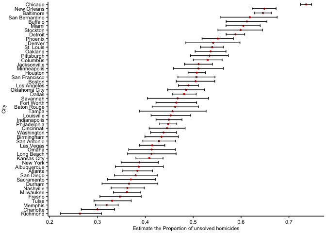

p8105_hw5_yq2378
================
Qi Yumeng
2023-11-12

``` r
library(tidyverse)
```

    ## ── Attaching core tidyverse packages ──────────────────────── tidyverse 2.0.0 ──
    ## ✔ dplyr     1.1.3     ✔ readr     2.1.4
    ## ✔ forcats   1.0.0     ✔ stringr   1.5.0
    ## ✔ ggplot2   3.4.4     ✔ tibble    3.2.1
    ## ✔ lubridate 1.9.3     ✔ tidyr     1.3.0
    ## ✔ purrr     1.0.2     
    ## ── Conflicts ────────────────────────────────────────── tidyverse_conflicts() ──
    ## ✖ dplyr::filter() masks stats::filter()
    ## ✖ dplyr::lag()    masks stats::lag()
    ## ℹ Use the conflicted package (<http://conflicted.r-lib.org/>) to force all conflicts to become errors

``` r
library(ggpubr)
library(patchwork)
```

# Problem 1

``` r
# loading data
homicide = read.csv("https://raw.githubusercontent.com/washingtonpost/data-homicides/master/homicide-data.csv")
```

The dataset contains 52179 observations of 12 variables. It has
information about the reported date, varies from 2007/1/1 to 2015/11/05,
the profile of the victim, including name, race, age and sex, also the
location and disposition of the cases.

``` r
homicide = homicide %>% 
  mutate(city_state = str_c(city, state, sep=", ")) 
ttl_bycity = homicide %>% 
  mutate(if_solved = if_else(disposition == "Closed by arrest",1,0 )) %>% 
  group_by(city) %>% summarise( ttl_cnt = n(), unsolved_cnt = n() - sum(if_solved), .groups = "keep") %>%
  arrange(desc(ttl_cnt)) 
ttl_bycity
```

    ## # A tibble: 50 × 3
    ## # Groups:   city [50]
    ##    city         ttl_cnt unsolved_cnt
    ##    <chr>          <int>        <dbl>
    ##  1 Chicago         5535         4073
    ##  2 Philadelphia    3037         1360
    ##  3 Houston         2942         1493
    ##  4 Baltimore       2827         1825
    ##  5 Detroit         2519         1482
    ##  6 Los Angeles     2257         1106
    ##  7 St. Louis       1677          905
    ##  8 Dallas          1567          754
    ##  9 Memphis         1514          483
    ## 10 New Orleans     1434          930
    ## # ℹ 40 more rows

`ttl_bycity` is the data frame summarizing total number of homicides and
the number of unsolved homicides within cities. The dataset includes 50
observations of 3 variables and the data is arranged by `ttl_cnt` (the
total count of homicides) descendant.

``` r
ttl_cnt = 2827
unsolved_cnt = 1825
prop_output = prop.test(x = unsolved_cnt, n = ttl_cnt)
broom::tidy(prop_output)
```

    ## # A tibble: 1 × 8
    ##   estimate statistic  p.value parameter conf.low conf.high method    alternative
    ##      <dbl>     <dbl>    <dbl>     <int>    <dbl>     <dbl> <chr>     <chr>      
    ## 1    0.646      239. 6.46e-54         1    0.628     0.663 1-sample… two.sided

``` r
estimate = broom::tidy(prop_output) %>% pull(estimate)
conf_low = broom::tidy(prop_output) %>% pull(conf.low)
conf_high = broom::tidy(prop_output) %>% pull(conf.high)
```

For the city of Baltimore, the test result is saved in `prop_output`.
The estimated proportion is 0.6455607 and the CI is (0.6276, 0.6632).

``` r
CI_bycity = 
  ttl_bycity |>
  mutate(prop_output = map2(.x = unsolved_cnt, .y = ttl_cnt, prop.test),
         prop_output = map(prop_output,broom::tidy)) |> 
  unnest(prop_output) |>
  mutate(CI = paste("(",round(conf.low,4),", ", round(conf.high,4),")", sep = ""),
         estimate = round(estimate, 4)) |>
  select(city, ttl_cnt, unsolved_cnt, estimate,CI, conf.low, conf.high)
CI_bycity
```

    ## # A tibble: 50 × 7
    ## # Groups:   city [50]
    ##    city         ttl_cnt unsolved_cnt estimate CI              conf.low conf.high
    ##    <chr>          <int>        <dbl>    <dbl> <chr>              <dbl>     <dbl>
    ##  1 Chicago         5535         4073    0.736 (0.724, 0.7474)    0.724     0.747
    ##  2 Philadelphia    3037         1360    0.448 (0.43, 0.4657)     0.430     0.466
    ##  3 Houston         2942         1493    0.507 (0.4892, 0.525…    0.489     0.526
    ##  4 Baltimore       2827         1825    0.646 (0.6276, 0.663…    0.628     0.663
    ##  5 Detroit         2519         1482    0.588 (0.5688, 0.607…    0.569     0.608
    ##  6 Los Angeles     2257         1106    0.49  (0.4692, 0.510…    0.469     0.511
    ##  7 St. Louis       1677          905    0.540 (0.5154, 0.563…    0.515     0.564
    ##  8 Dallas          1567          754    0.481 (0.4562, 0.506…    0.456     0.506
    ##  9 Memphis         1514          483    0.319 (0.2957, 0.343…    0.296     0.343
    ## 10 New Orleans     1434          930    0.648 (0.6231, 0.673…    0.623     0.673
    ## # ℹ 40 more rows

For each of the cities in the `ttl_bycity` dataset, we reserved `city`,
`ttl_cnt` and `unsolved_cnt` for reference. Through the iteration, we
pull the estimate of the target proportion and the CIs. We also saved
the `conf.low` and `conf.high` for later use.

``` r
CI_bycity |>
  ggplot(aes(x = fct_reorder(city,estimate), y = estimate))+ 
  geom_point(size = 0.8,col = "red") + 
  geom_errorbar(aes(ymin = conf.low,  ymax = conf.high), width = 0.6) + 
  coord_flip() + 
  theme_pubr() + xlab("City") + ylab("Estimate the Proportion of unsolved homicides") +
  theme(text = element_text(size = 8),
        plot.margin = unit(c(.1,.1,.1,.1),'cm'))
```

<!-- --> Each row
in the plot represents a city. The estimate proportion of unsolved cases
is marked by a red point. The CI for each city is the black line. Cities
are organized according to the proportion of unsolved homicides.

# Problem 2

``` r
file_name = list.files(path = "./data")
# need to specify the path
file_name = paste("./data/",file_name, sep="")
study = tibble(
  arm = substr(file_name,8,10),
  subject_id = substr(file_name,12,13)) |>
  mutate(table = map(file_name, read.csv)) |>
  unnest(cols = "table") |>
  pivot_longer(cols = starts_with("week_"),
               names_to = "week",
               values_to = "values") |>
  mutate(week = substr(week, 6,6),
         week = as.numeric(week),
         arm = if_else(arm == "exp","experimental","control"),)
study
```

    ## # A tibble: 160 × 4
    ##    arm     subject_id  week values
    ##    <chr>   <chr>      <dbl>  <dbl>
    ##  1 control 01             1   0.2 
    ##  2 control 01             2  -1.31
    ##  3 control 01             3   0.66
    ##  4 control 01             4   1.96
    ##  5 control 01             5   0.23
    ##  6 control 01             6   1.09
    ##  7 control 01             7   0.05
    ##  8 control 01             8   1.94
    ##  9 control 02             1   1.13
    ## 10 control 02             2  -0.88
    ## # ℹ 150 more rows

``` r
ggplot(data = study, aes(x = week, y = values,
                         color = subject_id, linetype = arm)) +
  geom_line(linewidth = 0.5)+
  theme_pubr(legend = "right") +
  labs(x = "Week Time", y = "Value") 
```

<!-- -->
The spaghetti plot shows observations on each subject over 8 weeks.
Colors are to differentiate subject ids and line type to illustrate the
control and experimental group. In general, the values for control
groups fluctuate around 1 and have no clear upward or downward trend. In
contrast, the values for experimental groups fluctuate around 3.5,
that’s clearly higher than the control. Also, the patients’ values in
the experimental seems to have upward trend through 8 weeks.

# Problem 3

``` r
n = 30
sigma = 5
mu_seq = seq(0,6)
alpha = 0.05

simulation = 
  tibble(id = seq(1,5000*length(mu_seq)),
         mu = rep(mu_seq,each = 5000)) |>
  mutate(data = map(mu, \(mu) rnorm(n, mean = mu,sd = sigma)),
         t_test = map(data, \(x) t.test(x, alternative = "two.sided",
                                        mu = 0, paired = FALSE, conf.level = alpha)),
         t_test_result = map(t_test, broom::tidy)) |>
  unnest(cols = "t_test_result") |>
  select(id, mu, p.value, estimate)
simulation  
```

    ## # A tibble: 35,000 × 4
    ##       id    mu p.value estimate
    ##    <int> <int>   <dbl>    <dbl>
    ##  1     1     0  0.179    1.23  
    ##  2     2     0  0.0984   1.37  
    ##  3     3     0  0.0394  -1.96  
    ##  4     4     0  0.899   -0.0938
    ##  5     5     0  0.223    1.15  
    ##  6     6     0  0.357   -0.993 
    ##  7     7     0  0.571    0.521 
    ##  8     8     0  0.0583   2.16  
    ##  9     9     0  0.553    0.643 
    ## 10    10     0  0.787    0.184 
    ## # ℹ 34,990 more rows

In the context of a one-sample t-test, effect size is typically measured
as the difference between the sample mean and the hypothesized
population mean $\mu = 0$ divided by the standard deviation $sd = 5$. In
this case, the effect size (in red color) is positively proportion to
true value of $\mu$. As the effect size increases, the power increases,
the most prominent change takes place around $\mu$ is around 1~3. As
$\mu$ is higher than 4, that is the effect size higher than 0.8, the
power reaches almost 100%.

``` r
simulation |> 
  mutate(if_reject = if_else(p.value < alpha,1,0)) |>
  group_by(mu) |> 
  summarise(proportion = sum(if_reject)/5000) |>
  ggplot(aes(x = mu, y = proportion)) + 
  geom_point()+
  geom_line()+
  geom_text(aes(label = paste0(round(proportion * 100), "%")),vjust = -0.5)+
  geom_text(aes(label = round(mu/5 ,2)),vjust = 2, col = "red")+
  theme_pubr() + xlab("True Value of mu") + ylab("the Power of the Test") 
```

<!-- -->

The sample average of $\hat{\mu}$ across tests for which the null is
rejected provides an estimate of the population mean, but it is subject
to randomness and variability. For example, the average estimate across
samples where the null is rejected may deviate from the true value due
to random sampling. Larger effect sizes and larger sample sizes tend to
yield more accurate estimates. Also, the rejection of the null
hypothesis is based on statistical significance, indicating that the
observed data is unlikely to have occurred by random chance alone. In
summary, it is not guaranteed to be exactly equal to the true value of
$\mu$, but it should be close to it on average.

``` r
p1 = 
  simulation |> 
  group_by(mu) |> 
  summarise(avg_mu = mean(estimate)) |>
  ggplot(aes(x = mu, y = avg_mu)) + 
  geom_point()+
  geom_text(aes(label = round(avg_mu ,2)),vjust = -0.5, col = "red")+
  theme_pubr() + xlab("True Value of mu") + ylab("Estimate Value of mu") 

p2 = 
  simulation |> 
  filter(p.value < alpha) |>
  group_by(mu) |> 
  summarise(avg_mu = mean(estimate)) |>
  ggplot(aes(x = mu, y = avg_mu)) + 
  geom_point()+
  geom_text(aes(label = round(avg_mu ,2)),vjust = -0.5, col = "red")+
  theme_pubr() + xlab("True Value of mu") + ylab("Estimate Value of mu") 
p1+p2
```

<!-- -->
